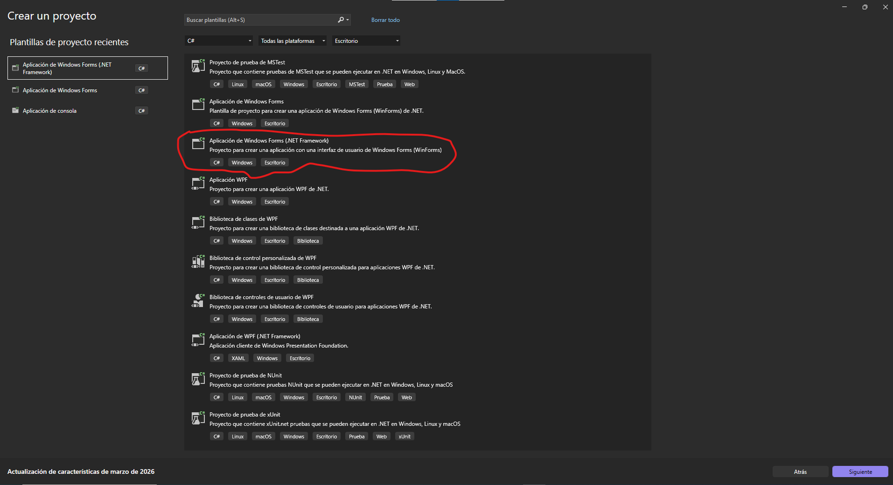

# CSharp-FileSystem-UNI-Prog_I1
Aplicación en C# (Windows Forms) que utiliza una arquitectura basada en interfaces para explorar directorios, verificar la existencia de archivos y leer su contenido de forma dinámica.

# FileTest - Explorador de Archivos y Directorios en C#

Este proyecto es una aplicación de escritorio desarrollada en **C# con Windows Forms (.NET 6.0)** que permite realizar operaciones comunes con el sistema de archivos. [cite_start]Utiliza una interfaz (`IFileSystemRepository`) para desacoplar la lógica de acceso a datos de la interfaz de usuario. [cite: 1, 3, 4]

##  Funcionalidades
* [cite_start]**Verificación de existencia**: Determina si una ruta ingresada corresponde a un archivo o directorio real. [cite: 41, 49]
* [cite_start]**Información Detallada**: Muestra fechas de creación, última modificación y último acceso. [cite: 52, 53, 54]
* [cite_start]**Lectura de Archivos**: Si la ruta es un archivo, muestra su contenido de texto. [cite: 66, 96]
* [cite_start]**Exploración de Directorios**: Si la ruta es una carpeta, lista todos los subdirectorios contenidos. [cite: 45, 112]

## Tecnologías Utilizadas
* **Lenguaje:** C#
* [cite_start]**Framework:** .NET 6.0 o superior [cite: 4]
* [cite_start]**Interfaz de Usuario:** Windows Forms (WinForms) [cite: 3]
* [cite_start]**Espacios de nombres:** `System.IO` para la manipulación de archivos. [cite: 29]

## Estructura del Código
1.  [cite_start]**IFileSystemRepository.cs**: Define el contrato para las operaciones de archivos (GetDirectories, FileExists, ReadFile, etc.). [cite: 18, 20-23]
2.  [cite_start]**FileSystemRepository.cs**: Implementación concreta de la interfaz que gestiona la lógica del sistema de archivos. [cite: 32]
3.  [cite_start]**Form1.cs**: Maneja la interacción del usuario, capturando eventos de teclado (`KeyDown`) para procesar las rutas ingresadas. [cite: 75, 81]

## Pasos con Capturas de Pantallas
> *Aquí puedes insertar una de las imágenes de tu práctica para mostrar el programa funcionando.*

1. Abrir Visual Studio 2022. 
2. Crear nuevo proyecto Windows Forms App (.NET). 
2. Asegúrese de que el Framework seleccionado sea .NET 6.0 o superior. 

> 

## Cómo ejecutarlo
1. [cite_start]Abrir la solución con **Visual Studio 2022**. [cite: 2]
2. [cite_start]Asegurarse de tener instalado el SDK de .NET 6.0+. [cite: 4]
3. [cite_start]Presionar `CTRL + F5` para compilar y ejecutar. [cite: 124]
