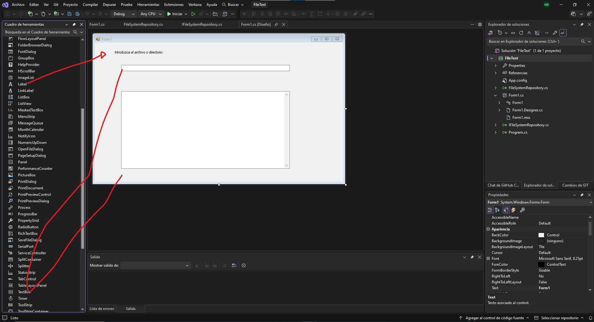
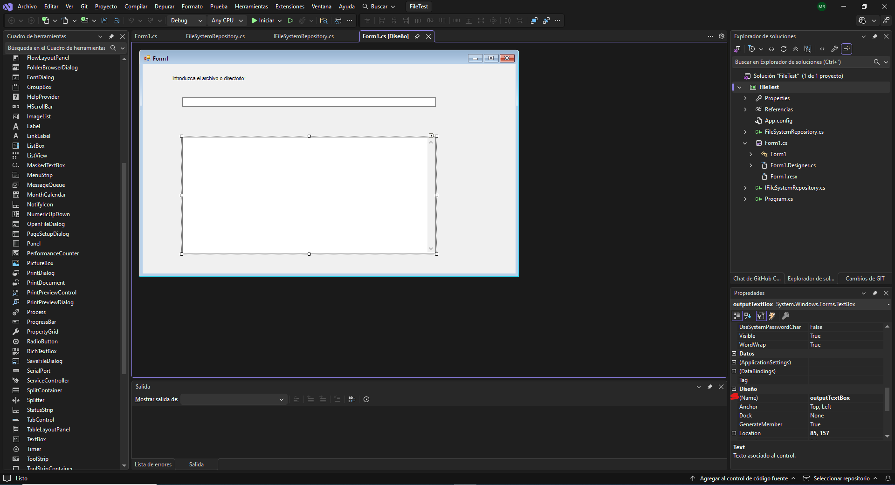
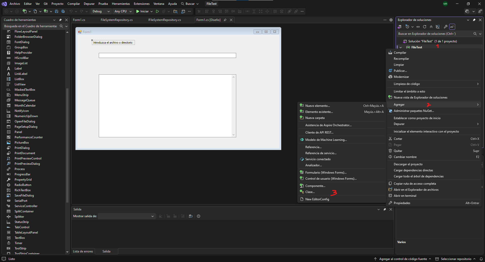
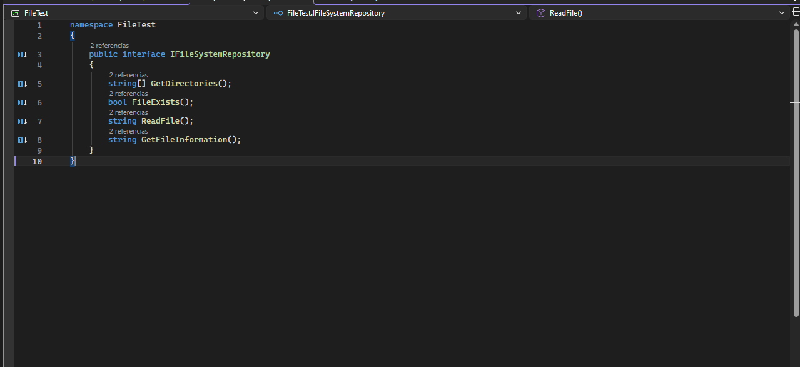
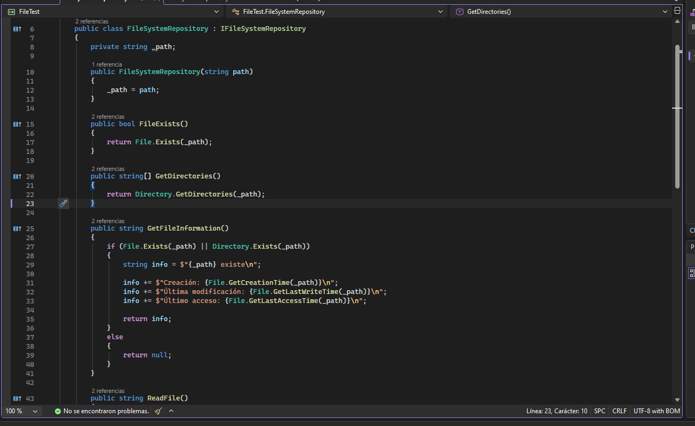
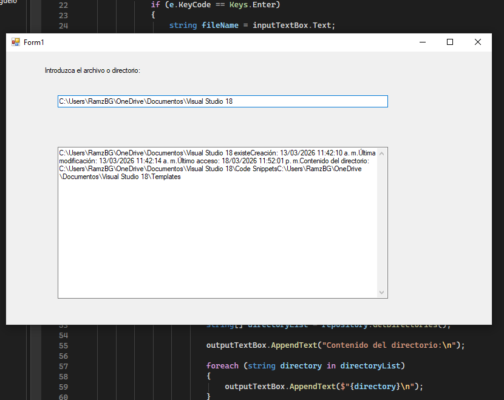
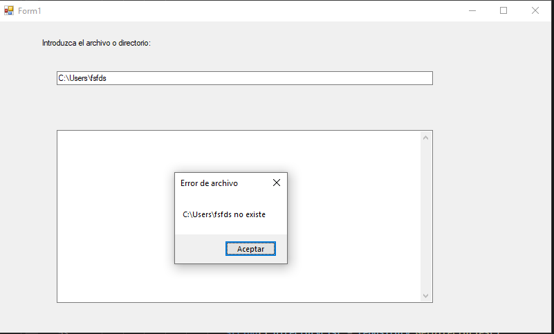

# CSharp-FileSystem-UNI-Prog_I #1
Aplicación en C# (Windows Forms) que utiliza una arquitectura basada en interfaces para explorar directorios, verificar la existencia de archivos y leer su contenido de forma dinámica.

# FileTest - Explorador de Archivos y Directorios en C#

Este proyecto es una aplicación de escritorio desarrollada en **C# con Windows Forms (.NET 6.0)** que permite realizar operaciones comunes con el sistema de archivos. [cite_start]Utiliza una interfaz (`IFileSystemRepository`) para desacoplar la lógica de acceso a datos de la interfaz de usuario. [cite: 1, 3, 4]

##  Funcionalidades
* [cite_start]**Verificación de existencia**: Determina si una ruta ingresada corresponde a un archivo o directorio real. [cite: 41, 49]
* [cite_start]**Información Detallada**: Muestra fechas de creación, última modificación y último acceso. [cite: 52, 53, 54]
* [cite_start]**Lectura de Archivos**: Si la ruta es un archivo, muestra su contenido de texto. [cite: 66, 96]
* [cite_start]**Exploración de Directorios**: Si la ruta es una carpeta, lista todos los subdirectorios contenidos. [cite: 45, 112]

## Tecnologías Utilizadas
* **Lenguaje:** C#
* [cite_start]**Framework:** .NET 6.0 o superior [cite: 4]
* [cite_start]**Interfaz de Usuario:** Windows Forms (WinForms) [cite: 3]
* [cite_start]**Espacios de nombres:** `System.IO` para la manipulación de archivos. [cite: 29]

## Estructura del Código
1.  [cite_start]**IFileSystemRepository.cs**: Define el contrato para las operaciones de archivos (GetDirectories, FileExists, ReadFile, etc.). [cite: 18, 20-23]
2.  [cite_start]**FileSystemRepository.cs**: Implementación concreta de la interfaz que gestiona la lógica del sistema de archivos. [cite: 32]
3.  [cite_start]**Form1.cs**: Maneja la interacción del usuario, capturando eventos de teclado (`KeyDown`) para procesar las rutas ingresadas. [cite: 75, 81]

## Pasos con Capturas de Pantallas
> *Pasos a seguir:*

1. Abrir Visual Studio 2022. 
2. Crear nuevo proyecto Windows Forms App (.NET). 
2. Asegúrese de que el Framework seleccionado sea .NET 6.0 o superior. 


4.En la solución, agregue una nueva interfaz llamada IFileSystemRepository.cs 
5.Cree una nueva clase llamada FileSystemRepository.cs. 
6. Crear la interfaz (Formulario)



7. Luego en el Formulario se agrega un Label que es para mostrar texto informativo, Nos vamos a sus propiedades y en la parte de Apariencia, Buscamos donde dice text y cambiamos el nombre (ya sea uno que le quiera poner el Usuario) 
8. Y también 2 TextBox, 1 TextBox (para escribir la ruta), 1 TextBox grande (para mostrar resultados). 
9. Luego hacemos click a un TextBox y Buscamos en propiedades, en la parte del diseño, donde dice (name).



10. En los dos TextBox le cambiamos el nombre, En el 1 TextBox (para escribir la ruta), le cambiamos el nombre y le ponemos (inputTextBox), Y en el 1 TextBox grande (para mostrar resultados), Le cambiamos el nombre y le ponemos (outputTextBox). 
11. Importante en las propiedades del 1 TextBox grande (para mostrar resultados nos vamos al apartado de, Multilínea Y la cambiamos en (TRUE), igual al apartado de ScrollBars la cambiamos a (Vertical).
12. Luego Creamos la interfaz (Interface o código). En el Explorador de soluciones le damos click derecho al proyecto (FileTest), Luego nos vamos donde dice Agregar, y buscamos clase.



13. A esa clase le ponemos el nombre

```csharp
namespace FileTest 

{ 
    public interface IFileSystemRepository 
    { 
        string [] GetDirectories (); 
        bool FileExists (); 
        string ReadFile (); 
        string GetFileInformation (); 
    } 
} 

```


14. Luego creamos la Clase Principal, haciendo el mismo procedimiento y le ponemos a la clase el nombre de (FileSystemRepository.cs) 


15. Luego a Esa clase le ponemos el siguiente codigo:

```csharp
using System; 
using System.IO; 
namespace FileTest 

{ 
    public class FileSystemRepository: IFileSystemRepository 
    { 
        private string _path; 
        public FileSystemRepository (string path) 
        { 
            _path = path; 
        } 
        public bool FileExists () 
        { 
            return File.Exists(_path); 
        } 
        public string [] GetDirectories () 
        { 
            return Directory. GetDirectories(_path); 
        }
        public string GetFileInformation () 
        { 
            if (File.Exists(_path) || Directory. Exists(_path)) 
            { 
                string info = $"{_path} existe\n"; 
                info += $"Creación: {File.GetCreationTime(_path)}\n"; 
                info += $"Última modificación: {File.GetLastWriteTime(_path)} \n"; 
                info += $"Último acceso: {File.GetLastAccessTime(_path)} \n"; 
                return info; 
            } 
            else 
            { 
                return null; 
            } 
        } 
        public string ReadFile () 
        {
            try 
            { 
                return File.ReadAllText(_path); 
            } 
            catch (IOException) 
            { 
                return null; 
            } 
        } 
    } 
} 

 ```
17. Luego se creará un método así:

```csharp
private void inputTextBox KeyDown(object sender, KeyEventArgs e) 
{ 
} 
```
18. Luego copiamos el siguiente Código: 

```csharp
if (e. Keycode == Keys. Enter) 
{
    string fileName = inputTextBox. Text; 
    IFileSystemRepository repository = 
        new FileSystemRepository(fileName);  
    string info = repository. GetFileInformation (); 
    outputTextBox.Clear();
    if (info! = null) 
    { 
        outputTextBox.AppendText(info); 
        if (repository. FileExists ()) 
        { 
            string content = repository. ReadFile (); 
            if (content! = null) 
            { 
                outputTextBox.AppendText(content); 
            } 
            else 
            { 
                MessageBox.Show("Error al leer el archivo", 
                "Error de archivo", 
                MessageBoxButtons.OK, 
                MessageBoxIcon.Error); 
            } 
        } 
        else 
        { 
            string [] directoryList = repository. GetDirectories (); 
            outputTextBox.AppendText("Contenido del directorio:\n"); 
            foreach (string directory in directoryList) 
            { 
                outputTextBox.AppendText($"{directory}\n"); 
            } 
        } 
    } 
    else 
    { 
        MessageBox.Show($"{inputTextBox.Text} no existe", 
        "Error de archivo", 
        MessageBoxButtons.OK, 
        MessageBoxIcon.Error); 
    } 
} 

 ```


19. Se ejecuta el programa (CTRL + F5),
20. 
21. Prueba del programa 
Se escribe el nombre de una carpeta ejemplo C: User\ 
Y mostrara los directores: 
*Creación 
*Última modificación 
*Último acceso 
*Contenido del archivo 
 


20. En caso de que no exista tal Ruta mandara un Mensaje que dirá que la Ruta no existe.

 

 

 

 

 

>  

## Cómo ejecutarlo
1. [cite_start]Abrir la solución con **Visual Studio 2022**. [cite: 2]
2. [cite_start]Asegurarse de tener instalado el SDK de .NET 6.0+. [cite: 4]
3. [cite_start]Presionar `CTRL + F5` para compilar y ejecutar. [cite: 124]
